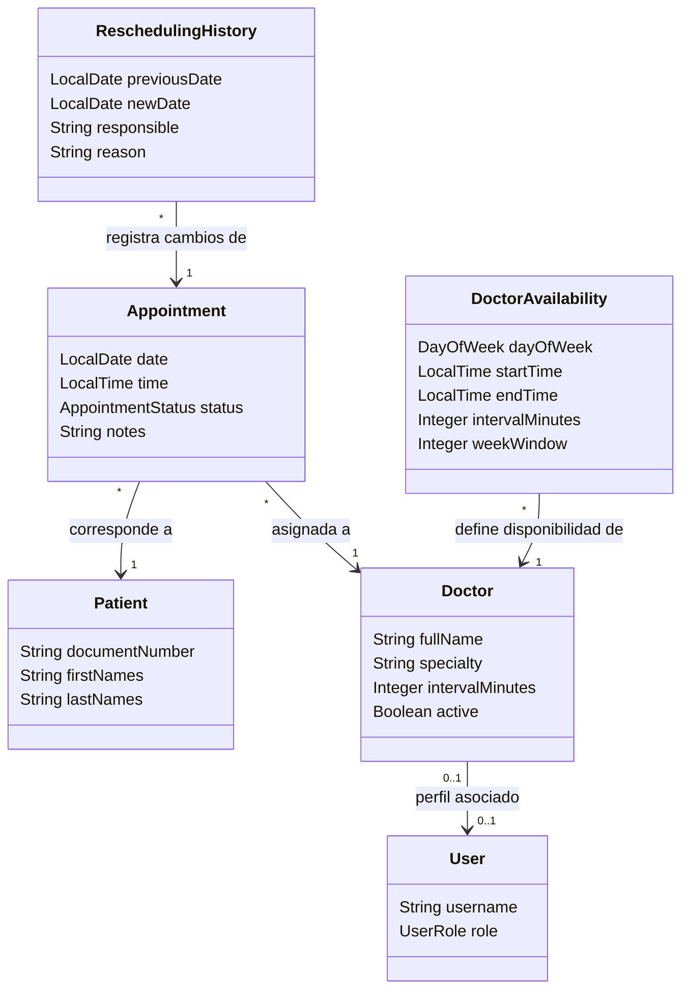
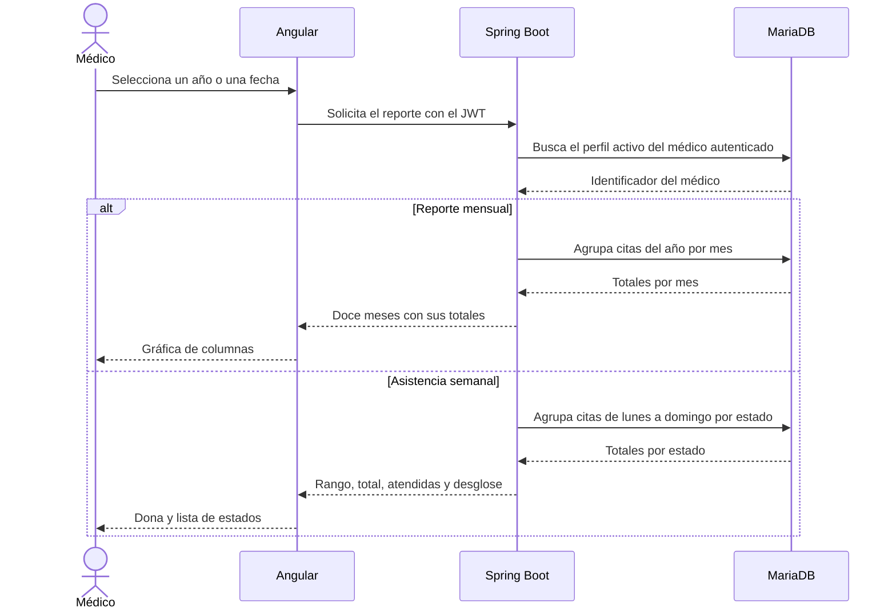

# PiedraAzul · UML de agenda y reportes

## Clases del dominio

```mermaid
classDiagram
    direction TB

    class Appointment {
        LocalDate date
        LocalTime time
        AppointmentStatus status
        String notes
    }

    class Doctor {
        String fullName
        String specialty
        Integer intervalMinutes
        Boolean active
    }

    class Patient {
        String documentNumber
        String firstNames
        String lastNames
    }

    class DoctorAvailability {
        DayOfWeek dayOfWeek
        LocalTime startTime
        LocalTime endTime
        Integer intervalMinutes
        Integer weekWindow
    }

    class ReschedulingHistory {
        LocalDate previousDate
        LocalDate newDate
        String responsible
        String reason
    }

    class User {
        String username
        UserRole role
    }

    Appointment "*" --> "1" Patient : corresponde a
    Appointment "*" --> "1" Doctor : asignada a
    DoctorAvailability "*" --> "1" Doctor : define disponibilidad de
    ReschedulingHistory "*" --> "1" Appointment : registra cambios de
    Doctor "0..1" --> "0..1" User : perfil asociado
```

## Secuencia · Consulta de estadísticas médicas

```mermaid
sequenceDiagram
    actor M as Médico
    participant W as Angular
    participant A as Spring Boot
    participant D as MariaDB

    M->>W: Selecciona un año o una fecha
    W->>A: Solicita el reporte con el JWT
    A->>D: Busca el perfil activo del médico autenticado
    D-->>A: Identificador del médico

    alt Reporte mensual
        A->>D: Agrupa citas del año por mes
        D-->>A: Totales por mes
        A-->>W: Doce meses con sus totales
        W-->>M: Gráfica de columnas
    else Asistencia semanal
        A->>D: Agrupa citas de lunes a domingo por estado
        D-->>A: Totales por estado
        A-->>W: Rango, total, atendidas y desglose
        W-->>M: Dona y lista de estados
    end
```